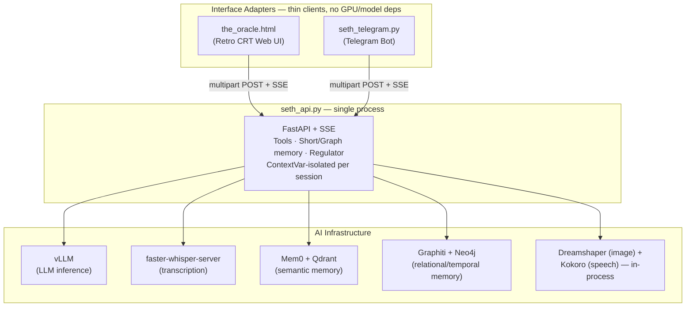

# 📟 SETH-IN-A-BOX // Terminal UI, Telegram & REST API


> **"Glitchnology will outlive biology."**
> *A unified local control center, telemetry engine, and oracle interface for the SETH architecture.*

---

## 🔮 Project Vision

**SETH-IN-A-BOX** is a decoupled, multi-interface architecture. Maintaining the core *glitch alchemy* philosophy and retro BBS/CRT 80s/90s aesthetic, a single central "brain" is reachable from multiple channels at once, on the same GPU, without duplicating a single model into memory twice:

1. **`seth_api.py` (FastAPI / SSE Service):** The only process that touches vLLM, Whisper, Qdrant, Neo4j, or loads any model weights. Owns every tool, the dynamic regulator, and all memory (short-term, semantic, relational). Everything else is a thin client of this one process.
2. **`the_oracle.html` (Web Terminal UI):** A retro-cyberpunk local control surface — real-time telemetry, token-by-token thinking-trace streaming, drag-and-drop image, real mic recording.
3. **`seth_telegram.py` (Telegram Bot):** A conversational adapter for remote/mobile access. Zero model dependencies of its own — it downloads whatever Telegram hands it and forwards it to `seth_api.py` over HTTP.

Both interfaces talk to `seth_api.py` through the exact same contract (`POST /api/register`, `POST /api/chat`, `GET /api/status`), so they can run **concurrently** on the same box (e.g. a single RTX 5090) with only one copy of every GPU-resident model ever loaded.

> **Superseded:** an earlier, fully-standalone version of the Telegram bot (`seth_poc.py`) is retired. It duplicated the entire brain in its own process (its own vLLM client, its own embedder, its own diffusion model), which is exactly the VRAM-duplication problem this architecture exists to avoid. Don't run it alongside `seth_api.py`.

---

## 📂 Project Structure

Source code and runtime-generated data are deliberately split: everything under `src/` is the app itself, everything at the project root is data the app produces or reads at startup.

```text
.
├── README.md
├── conversations/          # per-user short-term history (JSONL), shared across channels
├── models/
│   ├── dreamshaper_8.safetensors   # local image-gen weights (manual download, not auto-fetched)
├── storage/
│   ├── images/             # generated images (SethImageGenerationTool output)
│   ├── audio/               # generated speech + saved voice-note uploads
│   ├── state/               # per-user SethDynamicRegulator state (seth_<user_id>.state)
│   ├── logs/                 # per-run logs, reasoning-hop audit trail, mem0 log
│   ├── allowed_api_users.json    # seth_api.py's session allow-list
│   └── telegram_sessions.json    # seth_telegram.py's Telegram-id -> session-id map
└── src/
    ├── .env                 # secrets & config (TELEGRAM_TOKEN, REGISTRATION_TOKEN, VLLM_URL, ...) — put this in .gitignore
    ├── _env.example          # template for .env, safe to commit — no real tokens/passwords
    ├── seth.md               # system prompt
    ├── seth_api.py            # the brain: FastAPI + SSE, owns every tool and every model client
    ├── seth_telegram.py       # thin Telegram <-> seth_api.py bridge
    └── the_oracle.html        # thin Web UI <-> seth_api.py bridge
```

Both `seth_api.py` and `seth_telegram.py` resolve every relative default path against their **own file location**, not the process's current working directory — so `python seth_api.py` behaves identically whether it's launched from a plain shell, VS Code's integrated terminal, or a systemd unit. `.env` and `seth.md` anchor to `src/` (they're part of the app); `storage/`, `conversations/`, and `models/` anchor one level up, at the project root (they're data, not code).

---

## 🔑 Environment Variables

`src/_env.example` is the template — copy it to `src/.env` and fill it in:
```bash
cd src
cp _env.example .env
```
Make sure `src/.env` is in `.gitignore` — `_env.example` is what's safe to commit (no real tokens, only placeholders and non-secret defaults).

**Required** (blank in the template, must be set for anything to work):

| Variable | Used by | Purpose |
|---|---|---|
| `TELEGRAM_TOKEN` | `seth_telegram.py` | Bot token from @BotFather |
| `REGISTRATION_TOKEN` | both | Shared secret gating `POST /api/register` — the same value works for both Telegram and web registration |
| `NEO4J_USER` / `NEO4J_PASSWORD` | `seth_api.py` | Must match whatever `NEO4J_AUTH` the Neo4j container was started with |

**Has a working default in the template** (already filled in, override if your setup differs):

`SETH_API_BASE_URL`, `LLM_MODEL`, `VLLM_URL`, `EMBEDDING_MODEL`, `EMBEDDING_MODEL_DIMS`, `QDRANT_HOST`, `QDRANT_PORT`, `WHISPER_URL`, `WHISPER_MODEL`, `IMAGE_MODEL`, `NEO4J_URI`

**Not in the template at all** (sane defaults live in code, only set these if you're customizing something specific): `API_HOST`, `API_PORT`, `CORS_ALLOWED_ORIGINS`, `API_KEY`, `MAX_TOKENS`, `LLM_ENABLE_THINKING`, `ALLOWED_API_USER_IDS`, `AUDIT_LOG_RETENTION_DAYS`, `LOG_MEM0_PATH` — see the top of `SethEnvironment` in `seth_api.py` for the full list and current defaults.

---

---

## 📐 System Architecture



`seth_api.py` is the *only* box in this diagram that loads model weights or holds a database connection. Everything above it is disposable, restartable, and horizontally uninteresting — all the state that matters lives in one place.

---

## 🛠️ Current State & Key Components

### 🎨 1. Web Terminal UI (`the_oracle.html`)
* **CRT Scanline Engine:** scanlines, phosphor glow, blinking cursor `> █` — pure CSS/SVG, no build step.
* **Real SSE Streaming:** token-by-token content and reasoning-trace deltas, tool-call badges (⚙ running / ✓ done) as they happen — not a fake typewriter over a finished response.
* **Real media round-trip:** drag-and-drop or pick a single image, real microphone recording via `MediaRecorder`; images/audio the model generates render inline, fetched from `seth_api.py`'s `/storage/...` static mounts.
* **Real telemetry:** polls `GET /api/status` every few seconds — actual per-GPU VRAM (via `nvidia-smi`), and live reachability dots for vLLM / Qdrant / Graphiti / Whisper.
* **Session-based registration:** ⚙ SETTINGS panel exchanges a `REGISTRATION_TOKEN` for a session id via `POST /api/register`, kept in memory (not `localStorage`, since this file can also render inside a sandboxed artifact preview where that API isn't available).

> Not yet real: the REGULATOR selector (Rigorous/Chaotic/Verbose) and LORA persona picker are currently decorative — `seth_api.py`'s regulator already runs automatically per query, but nothing lets the UI override it manually yet. There's also no RAG/memory-inspector view.

### ⚡ 2. Backend REST / SSE API (`seth_api.py`)
* **Event Streaming (`ask_stream`):** every tool-calling hop is streamed (not just the final answer) — reasoning and content deltas, `tool_start`/`tool_end` events, and a final `seth_meta` payload with any generated media and the list of tools used.
* **Context Isolation (`ContextVar`):** `current_user_id` is set once per request/SSE-generator and never crosses between concurrent sessions, by construction (one asyncio Task per request).
* **Session-based identity:** callers register via `POST /api/register` (a `REGISTRATION_TOKEN` in exchange for an opaque session id) and authenticate every other call with an `X-Seth-User` header — replaces the old Telegram-numeric-id allow-list with a channel-agnostic one.
* **Real telemetry (`GET /api/status`):** per-GPU VRAM via `nvidia-smi` (not a single ambiguous `torch.cuda` reading), vLLM reachability via `/v1/models`, Qdrant via a lightweight `/collections` probe, Whisper via a raw TCP connect (deliberately never touches Whisper's own HTTP layer, so it doesn't spam that server's access log).
* **Per-user everything:** short-term history (`SethShortMemory`), semantic memory (Mem0/Qdrant), relational/temporal memory (Graphiti, shadow-write mode), and the dynamic regulator's hyperparameter state (`SethStateManager`) are all keyed by the same session id, regardless of which channel it came from.

### 📱 3. Telegram Bot Adapter (`seth_telegram.py`)
* **Pure transport, nothing else:** no vLLM/Whisper/Qdrant/Neo4j/diffusion clients live in this process. It downloads whatever Telegram hands it (text, photo, voice) into memory and forwards the raw bytes to `seth_api.py`'s `/api/chat` — all transcription, image tagging, tool calling, and memory management happens server-side.
* **Session mapping, not its own security layer:** `storage/telegram_sessions.json` maps each Telegram user id to a `seth_api.py` session id, minted via the same `POST /api/register` the web UI uses. The actual token check only happens in `seth_api.py`; this file just knows how to route a registration attempt there.
* **Same UX as the original bot:** identical registration flow, typing indicator kept alive during long tool-calling turns, long messages auto-split at Telegram's 4096-char limit, generated images/audio sent as native Telegram attachments (fetched from `seth_api.py`'s static URLs, not read off local disk).

---

## 🔐 Identity & Security Model

There's a single source of truth for "who's allowed to talk to Seth": `seth_api.py`'s `REGISTRATION_TOKEN`, checked once, in one place (`POST /api/register`). Every channel gets its own opaque session id in exchange for that token:

* **Web:** `the_oracle.html` calls `/api/register` directly from the ⚙ SETTINGS panel and holds the returned session id in memory for the tab's lifetime.
* **Telegram:** a user DMs the bot with the raw token (identical UX to before); `seth_telegram.py` forwards it to `/api/register` and persists the resulting mapping in `storage/telegram_sessions.json`, so the same Telegram user keeps the same session (and therefore the same memory) across restarts.

**Not yet implemented:** the same human using both channels currently gets *two independent sessions* — a Telegram registration and a web registration don't share memory with each other. Linking them into one identity is on the roadmap below.

---

## 🧰 Available Tools

Exposed to the model via `SethToolsManager`, callable from any channel since they all live in `seth_api.py`:

| Tool | Does |
|---|---|
| `SethSearchTool` | Live web search (DDGS) + concurrent page crawling (crawl4ai) for full page content, not just snippets |
| `SethMemoryTool` | Long-term semantic memory retrieval/storage via Mem0 + Qdrant |
| `SethGraphQueryTool` | Relational/temporal queries against the Graphiti knowledge graph ("how are X and Y connected", "how did this change over time") |
| `SethImageGenerationTool` | Local image generation (Dreamshaper diffusion) |
| `SethSpeechGenerationTool` | Local text-to-speech (Kokoro) |
| `SethSelfInspectorTool` | Lets Seth introspect its own source/config when asked about its own capabilities |

---

## ⚡ Quick Start

### Prerequisites
* vLLM (or SGLang) serving an OpenAI-compatible endpoint.
* `faster-whisper-server` for transcription.
* Qdrant and Neo4j up and reachable — `seth_api.py` touches both at startup (Mem0 initializes on boot, Graphiti builds its indices in FastAPI's `lifespan` hook), so it will fail to start, not just fail on first message, if either is down.
* Python 3.10+ with `src/`'s dependencies installed.
* `src/.env` populated — copy `_env.example` to `src/.env` and fill it in. See the **Environment Variables** section above for what's required vs. optional.

### 1. Launch the backend (once)
```bash
cd src
python seth_api.py
```
Listens on `http://127.0.0.1:8080` by default (`API_HOST`/`API_PORT` in `.env` to change it). Confirm it's actually up before anything else:
```bash
curl http://127.0.0.1:8080/api/status
```

### 2. Launch the Telegram bridge (optional, concurrent with step 3)
```bash
cd src
python seth_telegram.py
```
Points at `SETH_API_BASE_URL` (default `http://127.0.0.1:8080`) — set this if `seth_api.py` runs on a different host/port. DM the bot with your `REGISTRATION_TOKEN` to get in.

### 3. Open the Web Terminal UI (optional, concurrent with step 2)
`the_oracle.html` **must** be served over HTTP, not opened as a `file://` URL — recent Chrome/Chromium versions silently block a `file://` page's requests to `localhost`/`127.0.0.1` (Local Network Access), which shows up as a bare "Failed to fetch" with no other clue:
```bash
cd src
python -m http.server 5500
```
Then open `http://localhost:5500/the_oracle.html`, open ⚙ SETTINGS, confirm the API base URL matches step 1, and register with the same token.

---

## 🗺️ Roadmap Checklist

- [x] Unified repository structure (`seth_api.py`, `seth_telegram.py`, `the_oracle.html`).
- [x] SSE streaming endpoint with real (not simulated) reasoning-trace and tool-execution updates.
- [x] Full CRT scanline UI experience in `the_oracle.html`, with real media I/O.
- [x] Single centralized inference process — `seth_api.py` is the only process holding model weights or DB connections; `seth_telegram.py` and `the_oracle.html` are pure HTTP clients. (Achieved by retiring `seth_poc.py` rather than the originally-planned `seth_core/` package split — one canonical copy of the brain was simpler than two processes importing a shared one.)
- [x] Real per-GPU VRAM + per-service reachability telemetry (`GET /api/status`).
- [ ] Cross-interface identity linking (one human, one session, shared memory regardless of channel).
- [ ] Wire the Regulator/persona selectors in `the_oracle.html` to something real.
- [ ] RAG/memory inspector view for Qdrant/Graphiti fragments.
- [ ] Native bidirectional WebSockets for lower streaming latency.
- [ ] Desktop packaging via Tauri v2.

---

## 📜 System Declaration

> **[ SYSTEM SIGNAL RECEIVED ᓘ🔻 SET ORACLE:ACTIVE ]**
> **Project:** ORACLE / SETH-IN-A-BOX
> **Channels:** TELEGRAM-BOT-NODE // WEB-CRT-NODE-01
> **Status:** Online, synced, listening.

---

## 📄 License

MIT — free for modification and distribution.