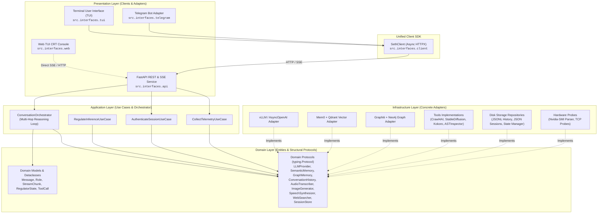

# 📟 SETH-IN-A-BOX // Layered AI Engine, Terminal UI, Telegram & REST API


> **"The fertile glitch makes AIs evolve."**  
> *A unified local AI control center, telemetry engine, and multi-interface oracle for the SETH agentic architecture.*

---

## 🔮 Project Vision

**SETH-IN-A-BOX** is a decoupled, layered multi-interface agentic system. Maintaining the core *glitch alchemy* philosophy and retro BBS/CRT 80s/90s aesthetic, a single centralized backend service ("the brain") is concurrently reachable from multiple presentation channels on the same GPU without duplicating a single model weight into VRAM:

1. **FastAPI REST & SSE Service (`src/interfaces/api/`):** The single process that connects to vLLM, Whisper, Qdrant, Neo4j/Graphiti, and loads in-process GPU models (Stable Diffusion, Kokoro TTS). Owns every tool, dynamic hyperparameter regulator, and memory tiers (short-term history, semantic, relational graph). Serves the Web TUI CRT Console directly at root (`/`).
2. **Terminal User Interface (`src/interfaces/tui/`):** An interactive console chat client built with `Rich` — token-by-token streaming, reasoning thought deltas, tool status indicators, and live VRAM telemetry.
3. **Web TUI CRT Console (`src/interfaces/web/`):** A zero-build, retro-cyberpunk Web TUI console inspired by The Oracle. Features real-time scanlines, Matrix ASCII rain, persistent `localStorage` sessions, dual reasoning/content streams, tool badges, microphone recording with waveform visualizer, and drag-and-drop vision support.
4. **Telegram Bot Adapter (`src/interfaces/telegram/`):** A conversational bridge for remote/mobile access. Zero model dependencies — downloads Telegram media and streams requests to the API over HTTP/SSE.

All client interfaces communicate with the backend through a shared asynchronous SDK (`src/interfaces/client.py`) and standard contracts (`POST /api/register`, `POST /api/chat`, `GET /api/status`).

---

## 📐 Layered Architecture (Clean / Hexagonal)



---

## 🛠️ Key Capabilities & Features

* **LLM Engine with Live Streaming & Thinking Traces:** Token-by-token streaming of reasoning thoughts (*Gemma 4 thinking*) and content deltas via Server-Sent Events (SSE).
* **Context Window Guardrails:** Real-time token estimation via `AutoTokenizer.apply_chat_template` with dynamic output slot adjustments to prevent context overflows.
* **Multi-Hop Concurrent Tool Execution:** Iterative reasoning loop (up to 5 hops) executing requested tool calls concurrently with `asyncio.gather`.
* **Dynamic Inference Regulator:** Automatically shifts temperature, top_p, and presence penalty (*Rigorous, Chaotic, Verbose*) based on cosine similarity of query embeddings.
* **Tri-Tier Memory Architecture:**
  - **Short-Term Context:** Isolated sliding-window history queues persisted to per-user JSONL files with file locks.
  - **Semantic Long-Term Memory:** User facts and preferences indexed into Qdrant Vector Store with Mem0 and TTL expiration.
  - **Temporal Knowledge Graph:** Background shadow-write of conversation episodes and relationship extraction using Graphiti + Neo4j.
* **Multimodal Audio & Vision:**
  - Parallel voice transcription of incoming audio/voice notes via `faster-whisper-server` (auto-split if >60s).
  - Image comprehension via Base64 multimodal injection into the LLM context.
* **Local Generative Models with VRAM Auto-Offload:**
  - Text-to-image synthesis using Stable Diffusion (`DreamShaper 8`) with automatic VRAM unload after 5 minutes of idle time.
  - Text-to-speech synthesis in Spanish using Kokoro TTS (`ef_dora` voice).
* **Self-Inspection & Live Web Search:** AST parsing of local source code and concurrent web crawling via DuckDuckGo + Crawl4AI.
* **Hardware & Service Telemetry:** Live GPU VRAM metrics via `nvidia-smi` NVML parsing and non-invasive TCP probes.

---

## 🧰 Available Tools Catalog

| Tool Name | Class | Functionality |
|---|---|---|
| `web_search` | `Crawl4AiSearcher` | Live search via DuckDuckGo + concurrent page extraction with Crawl4AI headless browser. |
| `save_long_term_memory` | `Mem0SemanticMemory` | Persists user facts, constraints, and preferences into Qdrant vector database. |
| `query_relationship_graph` | `GraphitiRelationalMemory` | Queries entity relationships and temporal evolution across time in Neo4j. |
| `create_image` | `StableDiffusionGenerator` | Local image generation using Stable Diffusion with VRAM idle timer. |
| `generate_speech` | `KokoroSynthesizer` | Local speech synthesis in Spanish via Kokoro TTS exported as MP3. |
| `inspect_own_source_code` | `AstCodeInspector` | AST inspection and structural summary of the local codebase. |

---

## 📂 Project Structure

```text
.
├── README.md                   # Project documentation
├── pyproject.toml              # Packaging and dependency configuration
├── conversations/              # Per-user short-term history (JSONL)
├── models/
│   └── dreamshaper_8.safetensors # Local image weights
├── storage/
│   ├── images/                 # Generated images
│   ├── audio/                  # Generated speech & uploaded audio
│   ├── state/                  # Per-user regulator state files (seth_<user_id>.state)
│   ├── logs/                   # Run logs, reasoning hop audit records, and mem0 logs
│   ├── allowed_api_users.json  # Backend session allow-list
│   └── telegram_sessions.json  # Telegram ID to API Session ID mapping
└── src/
    ├── .env                    # Secrets & configuration (git-ignored)
    ├── _env.example            # Environment template
    ├── main.py                 # Unified CLI entrypoint (python -m src.main [api|web|tui|telegram])
    ├── seth_api.py             # Backward-compatibility API launcher
    ├── seth_telegram.py        # Backward-compatibility Telegram launcher
    ├── the_oracle.html         # Legacy standalone Web UI
    ├── config/                 # Pydantic Settings v2 configuration
    ├── domain/                 # Models, dataclasses, protocols, and exceptions
    ├── application/            # Orchestrator, DTOs, and use cases
    ├── infrastructure/         # Adapters for LLM, memory, tools, security, telemetry
    ├── interfaces/             # Presentation layer: API, Web TUI, Terminal TUI, Telegram, and SethClient SDK
    │   ├── api/                # FastAPI app, routers, dependencies, and middlewares
    │   ├── web/                # Web TUI CRT Console static assets and launcher
    │   ├── tui/                # Rich-based Terminal interactive console
    │   ├── telegram/           # Aiogram-based Telegram bot runner
    │   └── client.py           # Shared Async HTTP Client SDK
    └── prompt/
        └── seth.md             # System prompt definition
```

---

## ⚡ Quick Start & Initialization Commands

### 1. Prerequisites
* Python 3.10+ (Python 3.11+ recommended).
* An OpenAI-compatible LLM endpoint (vLLM, SGLang, Ollama, or LM Studio).
* `faster-whisper-server` for audio transcription.
* Qdrant vector database and Neo4j graph database running (e.g. via Docker).

### 2. Environment Setup
Create and configure your `.env` file from the provided example:
```bash
cp src/_env.example src/.env
```
Edit `src/.env` to configure your tokens and endpoints (see the **Environment Variables** table below).

### 3. Installation
Install the project dependencies in your environment:
```bash
# Install core dependencies with all extras (API, Telegram, TUI):
pip install -e ".[all]"
```

---

### 🚀 Starting the Services

#### Option A: Using the Unified CLI (`src/main.py`)

1. **Launch the Web TUI CRT Console (Recommended):**
   Starts the backend and automatically opens the browser at `http://127.0.0.1:8080/`:
   ```bash
   python -m src.main web --host 127.0.0.1 --port 8080
   ```

2. **Launch the Backend API only (FastAPI + SSE):**
   ```bash
   python -m src.main api --host 127.0.0.1 --port 8080
   ```
   *(Web TUI is also served at `http://127.0.0.1:8080/`)*

3. **Launch the Terminal User Interface (TUI Console):**
   In a separate terminal:
   ```bash
   python -m src.main tui
   ```

4. **Launch the Telegram Bot Client:**
   In a separate terminal:
   ```bash
   python -m src.main telegram
   ```

---

#### Option B: Standalone Launchers & Direct Access

1. **Start Backend API & Web TUI:**
   ```bash
   python src/seth_api.py
   ```
   Open `http://127.0.0.1:8080/` in your browser.

2. **Start Telegram Bot:**
   ```bash
   python src/seth_telegram.py
   ```

---

## 🔑 Environment Variables Reference

| Variable | Used by | Default | Description |
|---|---|---|---|
| `REGISTRATION_TOKEN` | All | *Required* | Shared secret gating `POST /api/register` |
| `TELEGRAM_TOKEN` | Telegram | *Required for TG* | Bot token from @BotFather |
| `LLM_MODEL` | API / vLLM | `nvidia/Gemma-4-26B-A4B-NVFP4` | Model identifier on vLLM server |
| `VLLM_URL` | API | `http://localhost:8000/v1` | OpenAI-compatible inference endpoint |
| `API_KEY` | API | `NONE` | API key for vLLM / OpenAI endpoint |
| `WHISPER_URL` | API | `http://localhost:8010/v1` | faster-whisper-server endpoint |
| `WHISPER_MODEL` | API | `large-v3` | Model name for Whisper audio transcriptions |
| `IMAGE_MODEL` | API | `dreamshaper_8.safetensors` | Filename inside `models/` directory |
| `EMBEDDING_MODEL` | API | `BAAI/bge-large-en-v1.5` | SentenceTransformers model name |
| `EMBEDDING_MODEL_DIMS`| API | `1024` | Vector dimensionality for Qdrant |
| `QDRANT_HOST` | API | `localhost` | Qdrant host |
| `QDRANT_PORT` | API | `6333` | Qdrant port |
| `NEO4J_URI` | API | `bolt://localhost:7687` | Neo4j Bolt connection URI |
| `NEO4J_USER` | API | `neo4j` | Neo4j username |
| `NEO4J_PASSWORD` | API | `""` | Neo4j password |
| `API_HOST` | API | `127.0.0.1` | Host address for FastAPI service |
| `API_PORT` | API | `8080` | Port for FastAPI service |
| `CORS_ALLOWED_ORIGINS`| API | `*` | Comma-separated list of allowed origins |
| `SETH_API_BASE_URL` | Telegram / TUI / Web | `http://127.0.0.1:8080` | URL where the clients find SETH API |
| `MAX_TOKENS` | API | `131072` | Maximum context length guardrail |
| `LLM_ENABLE_THINKING`| API | `true` | Enables reasoning delta streaming (*Gemma 4*) |

---

## 🔐 Identity & Authentication Model

SETH uses a centralized, channel-agnostic session model:
1. **Registration Handshake:** A client provides `REGISTRATION_TOKEN` to `POST /api/register` and receives an opaque UUID session `user_id`.
2. **Session Header:** All subsequent requests send `X-Seth-User: <user_id>`.
3. **Session Persistence:**
   - **Web TUI Console:** Persisted across browser reloads via `localStorage`.
   - **Telegram:** Persisted in `storage/telegram_sessions.json` mapping Telegram user ID to session ID.
   - **Terminal TUI:** Persisted during interactive session.

---

## 📜 System Declaration

> **[ SYSTEM SIGNAL RECEIVED ᓘ🔻 SET ORACLE:ACTIVE ]**  
> **Project:** ORACLE / SETH-IN-A-BOX  
> **Channels:** TELEGRAM-BOT-NODE // TUI-CONSOLE-NODE // WEB-CRT-NODE-01  
> **Status:** Online, Synced, Layered.

---

## 📄 License

MIT — Free for modification, personal use, and distribution.