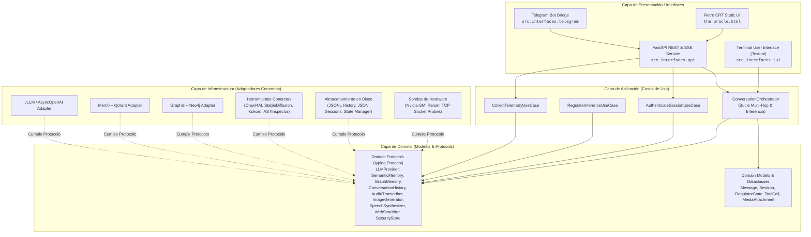
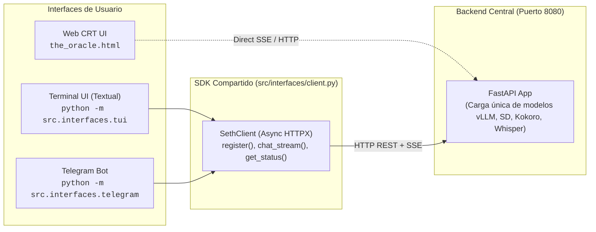
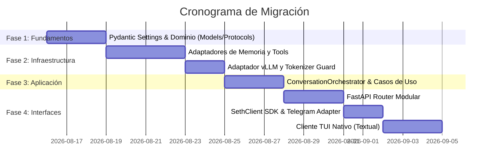

# Arquitectura por Capas y Modularización Idiomática en Python para SETH-IN-A-BOX

> **Documento Técnico de Ingeniería de Software**  
> **Proyecto:** SETH-IN-A-BOX (AKA Sentient Entity Thorn by Humans)  
> **Objetivo:** Análisis del código en `@src/`, catálogo de funcionalidades, diseño de arquitectura por capas desacoplada (API REST/SSE, TUI y Telegram Bot) y aplicación de estándares y modismos idiomáticos de Python (PEP 8, PEP 544 Protocols, Duck Typing, Dataclasses, Pydantic v2).  
> **Fecha de Actualización:** 2026-08-15  

---

## 1. Diagnóstico del Estado Actual (`@src/`)

### 1.1 Estructura Actual del Repositorio

El código fuente actual reside de forma monolítica en `src/`:

```text
.
├── conversations/          # Historial de contexto corto por usuario (JSONL)
├── models/                 # Pesos de modelos locales (DreamShaper safetensors)
├── storage/
│   ├── audio/              # Audios sintetizados (Kokoro) y grabaciones temporales
│   ├── images/             # Imágenes generadas (Stable Diffusion)
│   ├── logs/               # Logs de ejecución, reasoning hops y Mem0
│   ├── state/              # Estados dinámicos de inferencia (seth_<user_id>.state)
│   ├── allowed_api_users.json    # Lista blanca de sesiones API
│   └── telegram_sessions.json    # Mapeo Telegram User ID -> API Session ID
└── src/
    ├── _env.example        # Plantilla de variables de entorno
    ├── seth.md             # System Prompt y reglas de comportamiento de SETH
    ├── seth_api.py         # Monolito principal (FastAPI + LLM Engine + Tools + Memory) [2.629 líneas]
    ├── seth_telegram.py    # Cliente Telegram tipo puente HTTP [682 líneas]
    └── the_oracle.html     # Interfaz Web CRT retro en React 18 + SSE [950 líneas]
```

### 1.2 Problemas de Diseño en el Monolito Actual

El archivo `src/seth_api.py` (2.629 líneas) presenta problemas estructurales que dificultan el mantenimiento y la extensibilidad:

1. **Acoplamiento Multicapa en un Solo Archivo:**
   - La lógica de inferencia, la reflexión de esquemas de tools, los modelos pesados de IA (Stable Diffusion, Kokoro TTS, Mem0/Qdrant, Graphiti/Neo4j, Whisper), la persistencia en disco (JSONL con mutex) y las rutas HTTP de FastAPI conviven en un único módulo.
2. **Uso de Estado Mutable Global (Singletons):**
   - Clases como `Mem0MemorySingleton` y `GraphitiClientSingleton` guardan estado en atributos de clase (`_instance`), dificultando pruebas unitarias aisladas y violando la inversión de control.
3. **Ausencia de un Cliente TUI (Terminal User Interface):**
   - Existen la interfaz Web CRT (`the_oracle.html`) y el bot de Telegram (`seth_telegram.py`), pero no una interfaz nativa de terminal en consola enriquecida.
4. **Manejo de Concurrencia "Fire-and-Forget":**
   - Múltiples llamadas a `asyncio.create_task` sin supervisión de excepciones ni cancelación estructurada al apagar el servicio.

---

## 2. Índice Exhaustivo de Funcionalidades de SETH

El sistema posee las siguientes capacidades integradas en el backend:

| Módulo / Capacidad | Componente en `@src/` | Descripción Funcional |
|---|---|---|
| **Motor de Inferencia LLM** | `SethChatBot` / `vLLM` | Orquestación de llamadas asíncronas compatibles con OpenAI API, streaming SSE token a token y extracción de trazas de razonamiento (*Gemma 4 thinking*). |
| **Control de Desbordamiento de Contexto** | `SethChatBot._llm_call` | Estimación de tokens previa con `AutoTokenizer.apply_chat_template` y ajuste dinámico de `max_tokens` para evitar desbordes de ventana. |
| **Bucle Multi-Hop de Tools** | `SethChatBot.ask` / `ask_stream` | Ejecución iterativa de herramientas (hasta `max_tool_hops`, por defecto 5). Reconstrucción de llamadas streaming con `_StreamAccumulator` y ejecución concurrente vía `asyncio.gather`. |
| **Auditoría de Razonamiento** | `SethChatBot._persist_reasoning_audit` | Persistencia en disco (JSON) de cada turno de razonamiento, consultas, configuraciones de inferencia, llamadas a tools y respuestas, con depuración automática (retención de 30 días). |
| **Regulador Dinámico de Inferencia** | `SethDynamicRegulator`, `SethState` | Ajuste dinámico de hiperparámetros (`temperature`, `top_p`, `presence_penalty`) según la semántica de la consulta (modos *Rigorous*, *Chaotic*, *Verbose*) mediante similitud de coseno con `SentenceTransformer`. |
| **Gestor de Estados por Usuario** | `SethStateManager` | Persistencia y carga aislada de hiperparámetros por usuario (`storage/state/seth_<user_id>.state`) con locks asíncronos. |
| **Memoria a Corto Plazo (Contexto)** | `SethShortMemory`, `_UserSession` | Historial deslizante en memoria (`deque`) y persistencia transaccional en archivos JSONL (`conversations/history_<user_id>.jsonl`) aislados por usuario y protegidos por mutex. |
| **Memoria Semántica a Largo Plazo** | `SethMemoryTool`, `Mem0MemoryBuilder` | Indexación y búsqueda semántica de hechos y preferencias en Qdrant Vector Store usando Mem0 y embeddings `BAAI/bge-large-en-v1.5`, con TTL de expiración. |
| **Memoria Relacional y Temporal en Grafo** | `SethGraphMemory`, `GraphitiClientSingleton` | Inserción en segundo plano (*shadow mode*) de episodios de conversación y consultas de relaciones temporales y de entidades en Neo4j mediante Graphiti. |
| **Búsqueda Web e Ingesta de Páginas** | `SethSearchTool` | Búsqueda web en vivo con DuckDuckGo (`ddgs`) y rastreo/extracción concurrente de contenido markdown mediante navegador headless (`crawl4ai.AsyncWebCrawler`). |
| **Generación Local de Imágenes** | `SethImageGenerationTool` | Generación de imágenes 512x512 vía Stable Diffusion (modelo `DreamShaper 8`), scheduler DPM++ 2M Karras, soporte multi-GPU (preferencia `cuda:1`) y descarga automática de VRAM tras 5 minutos de inactividad. |
| **Síntesis de Voz (TTS)** | `SethSpeechGenerationTool` | Generación local de audio en español neutro mediante motor Kokoro (`KPipeline`, voz `ef_dora`), normalización a MP3 y guardado en disco. |
| **Transcripción de Audio / Voz** | `SethAPIBot._handle_uploaded_audio` | Recepción de notas de voz, particionado automático si supera 60s mediante `pydub`, y transcripción paralela con servidor `faster-whisper-server`. |
| **Entendimiento Multimodal de Imágenes** | `SethAPIBot._handle_uploaded_image` | Almacenamiento local de imágenes subidas por el usuario, codificación en Base64 e inyección en el array de mensajes multimodal del LLM. |
| **Inspección de Código y Auto-Reflexión** | `SethSelfInspectorTool` | Lectura segura del propio código fuente y parseo del árbol de sintaxis abstracta (`ast`) para extraer clases, funciones e imports cuando el usuario indaga sobre la arquitectura interna. |
| **Motor de Reflexión de Esquemas de Tools** | `SethToolsManager` | Generación automática de esquemas compatibles con OpenAI Function Calling analizando `Annotated[T, "descripción"]` y docstrings mediante `inspect` y `get_type_hints`. |
| **Autenticación y Control de Acceso** | `SethSecurityBoss` | Registro por apretón de manos con `REGISTRATION_TOKEN`, emisión de identificadores de sesión UUID opacos y persistencia de lista blanca (`allowed_api_users.json`). |
| **Telemetría y Monitor de Salud** | `SethAPIBot.status_endpoint` | Sondeo no invasivo por TCP a Whisper, consulta HTTP ligera a colecciones de Qdrant, verificación de Graphiti y medición de VRAM por GPU física mediante parsing de `nvidia-smi`. |
| **Capa de Transporte Telegram** | `seth_telegram.py` (`SethTelegramBridge`) | Adaptador ligero de Telegram: mapeo de sesiones (`telegram_sessions.json`), streaming HTTPX con SSE hacia la API, envío de typing indicators persistentes, división de mensajes largos (>4096 caracteres) preservando bloques de código markdown y envío de medios (fotos y audios nativos). |
| **Interfaz Web CRT Retro** | `the_oracle.html` | Terminal gráfica cyberpunk estilo scanline CRT: streaming en tiempo real de tokens y pensamientos, badges visuales de ejecución de herramientas, subida de imágenes y grabación por micrófono vía `MediaRecorder`. |

---

## 3. Filosofía de Diseño: Estándares Idiomáticos de Python

### 3.1 ¿Por qué Python no usa interfaces clásicas (`I...`) y cómo se modela idiomáticamente?

En lenguajes como Java o C#, las interfaces (`interface IRepository`) y la notación húngara (`IClassName`) son obligatorias para lograr polimorfismo. En **Python**, este enfoque es un anti-patrón ajeno al lenguaje (*un-pythonic*). 

Python resuelve el desacoplamiento mediante tres mecanismos nativos y elegantes:

1. **Duck Typing ("Si camina como pato y grazna como pato, es un pato"):**
   - El código cliente no necesita que una clase herede explícitamente de una interfaz; basta con que la clase implemente los métodos y atributos requeridos con la firma esperada.
2. **Subtipado Estructural con `typing.Protocol` (PEP 544):**
   - Introducido en Python 3.8, permite que herramientas de tipado estático (`mypy`, `pyright`, IDEs) verifiquen que un adaptador cumple un contrato **sin necesidad de herencia explícita**.
   - **Convención de Nombres en Python (PEP 8):** Se usan nombres sustantivos o descriptivos en `CapWords` sin prefijos artificiales: `LLMProvider`, `SemanticMemory`, `GraphMemory`, `ToolRegistry`, `ConversationHistory`, `AudioTranscriber`, `ImageGenerator`.
3. **Clases de Datos y Modelos Nativos:**
   - Se utilizan `@dataclass(slots=True, frozen=True)` para entidades de dominio inmutables y de alto rendimiento, y modelos de `Pydantic v2` para validación de entrada/salida en los bordes de la aplicación (API, DTOs).

---

## 4. Propuesta de Arquitectura por Capas

El sistema se divide en cuatro capas con dependencias en una sola dirección hacia el núcleo:



---

## 5. Estructura Modular de Directorios Propuesta para `@src/`

```text
src/
├── config/                     # Configuración centralizada tipada (Pydantic Settings)
│   ├── __init__.py
│   └── settings.py             # SethSettings cargando .env
│
├── domain/                     # CAPA DE DOMINIO (Puro Python, sin frameworks externos)
│   ├── __init__.py
│   ├── models.py               # Message, Role, StreamChunk, RegulatorState, ToolCall, Session
│   ├── protocols.py            # Contratos estructurales (typing.Protocol) sin prefijos 'I'
│   └── exceptions.py           # Jerarquía de excepciones de dominio (SethDomainError, etc.)
│
├── application/                # CAPA DE APLICACIÓN (Orquestación y Casos de Uso)
│   ├── __init__.py
│   ├── orchestrator.py         # ConversationOrchestrator (bucle principal de razonamiento y tools)
│   ├── dto.py                  # DTOs ligeros para transferencia entre capas
│   └── use_cases/              # Casos de uso específicos
│       ├── __init__.py
│       ├── authenticate.py     # Autenticación y registro de sesiones
│       ├── regulate.py         # Ajuste dinámico de temperatura y top_p
│       └── telemetry.py        # Recolección y consolidación de estado del sistema
│
├── infrastructure/             # CAPA DE INFRAESTRUCTURA (Adaptadores concretos y SDKs)
│   ├── __init__.py
│   ├── llm/                    # Adaptadores de LLM
│   │   ├── __init__.py
│   │   ├── vllm_client.py      # VllmClient (cumple LLMProvider)
│   │   ├── context_guard.py    # Control de ventana de contexto con AutoTokenizer
│   │   └── accumulator.py      # Reconstrucción de deltas de tool calls
│   ├── memory/                 # Adaptadores de memoria
│   │   ├── __init__.py
│   │   ├── qdrant_mem0.py      # Mem0Store (cumple SemanticMemory)
│   │   ├── neo4j_graphiti.py   # GraphitiStore (cumple GraphMemory)
│   │   └── jsonl_history.py    # JsonlConversationHistory (cumple ConversationHistory)
│   ├── tools/                  # Implementación de herramientas
│   │   ├── __init__.py
│   │   ├── registry.py         # ToolRegistry (descubrimiento y esquemas JSON)
│   │   ├── web_search.py       # Crawl4AiSearcher (cumple WebSearcher)
│   │   ├── image_diffusion.py  # StableDiffusionGenerator (cumple ImageGenerator)
│   │   ├── speech_kokoro.py    # KokoroSynthesizer (cumple SpeechSynthesizer)
│   │   └── code_inspector.py   # AstInspector (inspección de código fuente)
│   ├── security/               # Adaptadores de seguridad
│   │   ├── __init__.py
│   │   └── json_sessions.py    # JsonSessionStore (cumple SessionStore)
│   ├── telemetry/              # Sondas de hardware
│   │   ├── __init__.py
│   │   ├── nvidia_smi.py       # NvidiaSmiProbe (cumple HardwareProbe)
│   │   └── tcp_probe.py        # TcpProbe
│   └── logging/                # Configuración de logs y auditoría
│       ├── __init__.py
│       ├── setup.py            # ColoredLogs y supresión de ruido
│       └── audit.py            # AuditLogger (registro rotativo de razonamiento)
│
├── interfaces/                 # CAPA DE PRESENTACIÓN / INTERFACES DE USUARIO
│   ├── __init__.py
│   ├── client.py               # SethClient: SDK / Cliente HTTP asíncrono unificado
│   │
│   ├── api/                    # 1. API REST & SSE Service (FastAPI)
│   │   ├── __init__.py
│   │   ├── app.py              # FastAPI app, Lifespan y montaje de estáticos
│   │   ├── dependencies.py     # Inyección de dependencias con Depends()
│   │   ├── routes/
│   │   │   ├── __init__.py
│   │   │   ├── auth.py         # POST /api/register
│   │   │   ├── chat.py         # POST /api/chat (Multipart & SSE)
│   │   │   └── status.py       # GET /api/status
│   │   └── middleware/
│   │       ├── pna.py          # Private Network Access
│   │       └── log_filter.py   # Filtro para suprimir logs ruidosos de polling
│   │
│   ├── tui/                    # 2. Terminal User Interface (TUI Nativo en Consola)
│   │   ├── __init__.py
│   │   ├── app.py              # Aplicación Textual (consola CRT cyberpunk)
│   │   ├── screens.py          # Pantallas de chat y telemetría
│   │   └── widgets.py          # Widgets de VRAM, log de pensamientos y tools
│   │
│   └── telegram/               # 3. Cliente Telegram Bot
│       ├── __init__.py
│       ├── bot.py              # TelegramBotRunner (python-telegram-bot)
│       ├── handlers.py         # Manejadores de texto, audio y fotos
│       └── session_store.py    # Mapeo local de sesiones Telegram
│
├── prompt/                     # Assets del prompt del sistema
│   └── seth.md
│
└── main.py                     # Entrypoint CLI para ejecutar backend o clientes
```

---

## 6. Implementación Idiomática de Capas

### 6.1 Capa de Dominio: Modelos y Protocolos (`typing.Protocol`)

En lugar de interfaces pesadas o prefijos `I`, se definen contratos claros con `typing.Protocol`:

```python
# src/domain/models.py
from __future__ import annotations
from dataclasses import dataclass, field
from enum import StrEnum
from typing import Any

class Role(StrEnum):
    SYSTEM = "system"
    USER = "user"
    ASSISTANT = "assistant"
    TOOL = "tool"

class StreamEventType(StrEnum):
    REASONING = "reasoning"
    CONTENT = "content"
    TOOL_START = "tool_start"
    TOOL_END = "tool_end"
    DONE = "done"
    ERROR = "error"

@dataclass(slots=True, frozen=True)
class ToolCall:
    call_id: str
    name: str
    arguments: str

@dataclass(slots=True, frozen=True)
class Message:
    role: Role
    content: str | list[dict[str, Any]]
    tool_call_id: str | None = None
    tool_calls: list[ToolCall] = field(default_factory=list)

@dataclass(slots=True, frozen=True)
class StreamChunk:
    event_type: StreamEventType
    text: str = ""
    tool_name: str | None = None
    ok: bool = True
    metadata: dict[str, Any] = field(default_factory=dict)

@dataclass(slots=True)
class RegulatorState:
    temperature: float = 0.25
    top_p: float = 0.85
    presence_penalty: float = 0.2

    def interpolate(self, target: RegulatorState, alpha: float) -> None:
        self.temperature += alpha * (target.temperature - self.temperature)
        self.top_p += alpha * (target.top_p - self.top_p)
        self.presence_penalty += alpha * (target.presence_penalty - self.presence_penalty)
```

```python
# src/domain/protocols.py
from __future__ import annotations
from typing import Any, AsyncIterator, Protocol
from src.domain.models import Message, RegulatorState, StreamChunk

class LLMProvider(Protocol):
    """Protocolo estructural para motores de inferencia LLM."""
    async def generate(
        self,
        messages: list[Message],
        tools: list[dict[str, Any]] | None,
        config: RegulatorState
    ) -> Message:
        ...

    async def generate_stream(
        self,
        messages: list[Message],
        tools: list[dict[str, Any]] | None,
        config: RegulatorState
    ) -> AsyncIterator[StreamChunk]:
        ...

class SemanticMemory(Protocol):
    """Protocolo para almacenamiento y recuperación vectorial (Mem0 / Qdrant)."""
    async def search(self, user_id: str, query: str, limit: int = 10) -> list[str]:
        ...
    async def save(self, user_id: str, fact: str, response: str) -> bool:
        ...

class GraphMemory(Protocol):
    """Protocolo para memoria temporal y relacional (Graphiti / Neo4j)."""
    async def add_episode(self, user_id: str, user_text: str, assistant_text: str) -> None:
        ...
    async def query_relations(self, user_id: str, query: str) -> list[str]:
        ...

class ConversationHistory(Protocol):
    """Protocolo para persistencia del historial de contexto corto."""
    async def get_history(self, user_id: str) -> list[Message]:
        ...
    async def append_turn(self, user_id: str, user_text: str, assistant_text: str) -> None:
        ...

class AudioTranscriber(Protocol):
    """Protocolo para transcripción de audio (Whisper)."""
    async def transcribe(self, audio_bytes: bytes, filename: str) -> str | None:
        ...

class ImageGenerator(Protocol):
    """Protocolo para generación de imágenes (Stable Diffusion)."""
    async def generate_image(self, prompt: str) -> str:
        ...

class SpeechSynthesizer(Protocol):
    """Protocolo para síntesis de voz (Kokoro)."""
    async def synthesize(self, text: str) -> str:
        ...

class WebSearcher(Protocol):
    """Protocolo para búsqueda y crawling web (DDGS + Crawl4AI)."""
    async def search_and_crawl(self, query: str, max_results: int = 5) -> str:
        ...

class SessionStore(Protocol):
    """Protocolo para validación y persistencia de usuarios autorizados."""
    def is_allowed(self, user_id: str) -> bool:
        ...
    def register(self, user_id: str, token: str) -> bool:
        ...
```

### 6.2 Capa de Aplicación: Orquestador de Conversación

El `ConversationOrchestrator` implementa el flujo de negocio central desacoplado de FastAPI y Telegram:

```python
# src/application/orchestrator.py
from __future__ import annotations
import asyncio
import logging
from typing import AsyncIterator
from src.domain.models import Message, Role, StreamChunk, StreamEventType
from src.domain.protocols import (
    ConversationHistory,
    GraphMemory,
    LLMProvider,
    SemanticMemory,
)
from src.infrastructure.tools.registry import ToolRegistry
from src.application.use_cases.regulate import RegulateInferenceUseCase

logger = logging.getLogger(__name__)

class ConversationOrchestrator:
    """Coordina el bucle de razonamiento, memorias y ejecución de tools."""

    def __init__(
        self,
        llm: LLMProvider,
        tools: ToolRegistry,
        semantic_memory: SemanticMemory,
        graph_memory: GraphMemory,
        history_repo: ConversationHistory,
        regulator: RegulateInferenceUseCase,
        system_prompt: str,
        max_tool_hops: int = 5,
    ) -> None:
        self.llm = llm
        self.tools = tools
        self.semantic_memory = semantic_memory
        self.graph_memory = graph_memory
        self.history_repo = history_repo
        self.regulator = regulator
        self.system_prompt = system_prompt
        self.max_tool_hops = max_tool_hops

    async def execute_stream(
        self,
        user_id: str,
        user_text: str,
        image_b64: str | None = None
    ) -> AsyncIterator[StreamChunk]:
        """Ejecuta el pipeline completo de inferencia con streaming."""
        
        # 1. Recuperar contexto previo
        history = await self.history_repo.get_history(user_id)
        
        # 2. Ajustar hiperparámetros (Regulador Dinámico)
        state = await self.regulator.adjust_for_query(user_id, user_text)
        
        # 3. Consultar memoria semántica
        memories = await self.semantic_memory.search(user_id, user_text)
        
        # 4. Ensamblar mensajes iniciales
        messages = self._build_prompt_messages(history, user_text, image_b64, memories)
        tool_schemas = self.tools.get_openai_schemas()
        
        tool_calls_used: list[str] = []
        final_response_content = ""

        # 5. Bucle Multi-Hop de Razonamiento
        for hop in range(self.max_tool_hops):
            logger.info("🧠 LLM Hop %d/%d (user: %s)", hop + 1, self.max_tool_hops, user_id)
            
            hop_tool_requests = []
            async for chunk in self.llm.generate_stream(messages, tool_schemas, state):
                if chunk.event_type == StreamEventType.REASONING:
                    yield chunk
                elif chunk.event_type == StreamEventType.CONTENT:
                    final_response_content += chunk.text
                    yield chunk
                elif chunk.event_type == StreamEventType.TOOL_START:
                    hop_tool_requests.append(chunk.metadata["tool_call"])

            if not hop_tool_requests:
                # El modelo terminó sin solicitar herramientas
                break

            # Ejecución concurrente de herramientas
            for call in hop_tool_requests:
                tool_calls_used.append(call.name)
                yield StreamChunk(event_type=StreamEventType.TOOL_START, tool_name=call.name)

            tool_results = await asyncio.gather(
                *(self.tools.execute(c.name, c.arguments, user_id=user_id) for c in hop_tool_requests)
            )

            for res in tool_results:
                yield StreamChunk(event_type=StreamEventType.TOOL_END, tool_name=res.name, ok=res.is_success)
                messages.append(Message(role=Role.TOOL, content=res.output, tool_call_id=res.call_id))

        # 6. Guardar en memorias en background
        if final_response_content:
            await self.history_repo.append_turn(user_id, user_text, final_response_content)
            asyncio.create_task(self.graph_memory.add_episode(user_id, user_text, final_response_content))

        yield StreamChunk(
            event_type=StreamEventType.DONE,
            text=final_response_content,
            metadata={"tool_calls_used": tool_calls_used, "hop_count": hop + 1}
        )

    def _build_prompt_messages(
        self,
        history: list[Message],
        user_text: str,
        image_b64: str | None,
        memories: list[str]
    ) -> list[Message]:
        system_content = self.system_prompt
        if memories:
            system_content += "\n\n<MEMORY>\n" + "\n".join(f"- {m}" for m in memories) + "\n</MEMORY>"

        msgs = [Message(role=Role.SYSTEM, content=system_content)]
        msgs.extend(history)

        if image_b64:
            user_content = [
                {"type": "text", "text": user_text},
                {"type": "image_url", "image_url": {"url": f"data:image/jpeg;base64,{image_b64}"}}
            ]
        else:
            user_content = user_text

        msgs.append(Message(role=Role.USER, content=user_content))
        return msgs
```

---

## 7. Desacoplamiento de Interfaces: API, TUI y Telegram



### 7.1 Cliente SDK Compartido (`src/interfaces/client.py`)

```python
# src/interfaces/client.py
from __future__ import annotations
import json
from typing import AsyncIterator
import httpx

class SethClient:
    """Cliente HTTP asíncrono para interactuar con el backend de SETH."""

    def __init__(self, base_url: str = "http://127.0.0.1:8080", timeout_secs: float = 300.0) -> None:
        self.base_url = base_url.rstrip("/")
        self._timeout = httpx.Timeout(connect=15.0, read=timeout_secs, write=120.0, pool=10.0)

    async def register(self, token: str) -> str | None:
        """Intercambia un token por un user_id de sesión."""
        async with httpx.AsyncClient(timeout=self._timeout) as http:
            resp = await http.post(f"{self.base_url}/api/register", json={"token": token})
            if resp.status_code == 200:
                return resp.json().get("user_id")
            return None

    async def chat_stream(
        self,
        user_id: str,
        message: str = "",
        image_bytes: bytes | None = None,
        audio_bytes: bytes | None = None,
    ) -> AsyncIterator[dict]:
        """Envía entrada multimodal y recibe eventos SSE en tiempo real."""
        files = {}
        if image_bytes:
            files["image"] = ("image.jpg", image_bytes, "image/jpeg")
        if audio_bytes:
            files["audio"] = ("audio.ogg", audio_bytes, "audio/ogg")

        headers = {"X-Seth-User": user_id}

        async with httpx.AsyncClient(timeout=self._timeout) as http:
            async with http.stream(
                "POST",
                f"{self.base_url}/api/chat",
                data={"message": message},
                files=files or None,
                headers=headers
            ) as resp:
                resp.raise_for_status()
                buffer = ""
                async for chunk in resp.aiter_text():
                    buffer += chunk
                    lines = buffer.split("\n")
                    buffer = lines.pop()
                    for line in lines:
                        line = line.strip()
                        if line.startswith("data:") and line != "data: [DONE]":
                            try:
                                yield json.loads(line[5:].strip())
                            except json.JSONDecodeError:
                                continue

    async def get_status(self) -> dict:
        """Obtiene la telemetría del sistema y VRAM."""
        async with httpx.AsyncClient(timeout=self._timeout) as http:
            resp = await http.get(f"{self.base_url}/api/status")
            return resp.json()
```

### 7.2 Implementación del Cliente TUI con `Textual` (`src/interfaces/tui/app.py`)

El cliente TUI ofrece una terminal interactiva en consola que reproduce la estética retro CRT de *The Oracle*:

```python
# src/interfaces/tui/app.py
from __future__ import annotations
import asyncio
from textual.app import App, ComposeResult
from textual.containers import Container, Horizontal, VerticalScroll
from textual.widgets import Footer, Header, Input, Static
from rich.markdown import Markdown
from src.interfaces.client import SethClient

class TelemetryBar(Static):
    """Barra superior con indicadores de estado y VRAM."""
    def update_metrics(self, data: dict) -> None:
        vllm = "🟢" if "online" in data.get("vllm", "") else "🔴"
        qdrant = "🟢" if "online" in data.get("qdrant", "") else "🔴"
        vram_info = data.get("vram", [{}])
        vram_text = f"VRAM: {vram_info[0].get('used_gb', 0)}GB / {vram_info[0].get('total_gb', 0)}GB" if vram_info else ""
        self.update(f"vLLM: {vllm} | Qdrant: {qdrant} | {vram_text}")

class ChatHistory(VerticalScroll):
    """Contenedor desplazable de mensajes con renderizado Markdown."""
    def add_message(self, role: str, text: str) -> None:
        prefix = "[bold cyan]> USER:[/bold cyan]" if role == "user" else "[bold green]> SETH:[/bold green]"
        self.mount(Static(f"{prefix}\n", Markdown(text)))
        self.scroll_end(animate=False)

class SethTUI(App):
    """Aplicación Terminal User Interface para SETH-IN-A-BOX."""
    CSS = """
    Screen { background: #030308; color: #00f0ff; }
    TelemetryBar { dock: top; height: 1; background: #090914; color: #39ff14; }
    Input { dock: bottom; border: tall #00f0ff; background: #030308; color: #00f0ff; }
    """

    def __init__(self, client: SethClient, user_id: str) -> None:
        super().__init__()
        self.client = client
        self.user_id = user_id

    def compose(self) -> ComposeResult:
        yield TelemetryBar(id="telemetry")
        yield ChatHistory(id="chat_history")
        yield Input(placeholder="Escribí un mensaje o comando... (Ctrl+C para salir)", id="user_input")
        yield Footer()

    async def on_mount(self) -> None:
        self.set_interval(5.0, self.refresh_telemetry)
        await self.refresh_telemetry()

    async def refresh_telemetry(self) -> None:
        try:
            status = await self.client.get_status()
            self.query_one(TelemetryBar).update_metrics(status)
        except Exception:
            pass

    async def on_input_submitted(self, event: Input.Submitted) -> None:
        text = event.value.strip()
        if not text:
            return
        
        chat = self.query_one(ChatHistory)
        input_widget = self.query_one(Input)
        input_widget.value = ""
        
        chat.add_message("user", text)
        
        # Streaming de respuesta
        response_accumulator = ""
        async for event_data in self.client.chat_stream(self.user_id, message=text):
            choice = (event_data.get("choices") or [{}])[0]
            delta = choice.get("delta") or {}
            if delta.get("content"):
                response_accumulator += delta["content"]
        
        chat.add_message("assistant", response_accumulator)

if __name__ == "__main__":
    client = SethClient("http://127.0.0.1:8080")
    app = SethTUI(client, user_id="cli_user")
    app.run()
```

---

## 8. Recomendaciones de Estándares Python y Buenas Prácticas

### 8.1 Configuración con Pydantic Settings

```python
# src/config/settings.py
from pathlib import Path
from pydantic import Field, HttpUrl
from pydantic_settings import BaseSettings, SettingsConfigDict

class SethSettings(BaseSettings):
    model_config = SettingsConfigDict(
        env_file=".env",
        env_file_encoding="utf-8",
        extra="ignore"
    )

    base_dir: Path = Field(default_factory=lambda: Path(__file__).resolve().parent.parent)
    project_root: Path = Field(default_factory=lambda: Path(__file__).resolve().parent.parent.parent)

    llm_model: str = "nvidia/Gemma-4-26B-A4B-NVFP4"
    vllm_url: HttpUrl = "http://localhost:8000/v1"
    whisper_url: HttpUrl = "http://localhost:8010/v1"
    whisper_model: str = "large-v3"
    
    registration_token: str = Field(..., min_length=8)
    neo4j_uri: str = "bolt://localhost:7687"
    neo4j_user: str = "neo4j"
    neo4j_password: str = ""
```

### 8.2 Inyección de Dependencias Limpia en FastAPI (`Depends`)

En lugar de singletons globales, FastAPI gestiona las dependencias a través de su sistema nativo de `Depends()`:

```python
# src/interfaces/api/dependencies.py
from fastapi import Request
from src.application.orchestrator import ConversationOrchestrator
from src.domain.protocols import SessionStore

def get_orchestrator(request: Request) -> ConversationOrchestrator:
    return request.app.state.orchestrator

def get_session_store(request: Request) -> SessionStore:
    return request.app.state.session_store
```

### 8.3 Jerarquía de Excepciones de Dominio

```python
# src/domain/exceptions.py
class SethError(Exception):
    """Excepción raíz de la aplicación."""

class SessionUnauthorizedError(SethError):
    """Token de registro inválido o sesión no permitida."""

class ContextLimitExceededError(SethError):
    """La consulta supera la ventana máxima de contexto."""

class ToolExecutionError(SethError):
    """Fallo en la ejecución de una herramienta."""
```

### 8.4 Empaquetado y Dependencias Opcionales en `pyproject.toml`

Permite instalar clientes ligeros (como el TUI o Telegram) sin necesidad de descargar librerías pesadas de GPU (`torch`, `diffusers`, `kokoro`):

```toml
# pyproject.toml
[project]
name = "seth-in-a-box"
version = "2.0.0"
description = "Multi-interface AI Oracle & Agentic Engine"
readme = "README.md"
requires-python = ">=3.10"
dependencies = [
    "httpx>=0.27.0",
    "pydantic>=2.7.0",
    "pydantic-settings>=2.2.0",
    "coloredlogs>=15.0.1",
]

[project.optional-dependencies]
api = [
    "fastapi>=0.110.0",
    "uvicorn>=0.28.0",
    "openai>=1.14.0",
    "qdrant-client>=1.8.0",
    "mem0ai>=0.1.0",
    "graphiti-core>=0.3.0",
    "sentence-transformers>=2.5.0",
    "crawl4ai>=0.4.0",
    "duckduckgo-search>=5.0.0",
    "torch>=2.2.0",
    "diffusers>=0.27.0",
    "kokoro>=0.3.0",
    "pydub>=0.25.1",
    "soundfile>=0.12.1",
]
telegram = [
    "python-telegram-bot>=21.0",
]
tui = [
    "textual>=0.53.0",
    "rich>=13.7.0",
]
all = [
    "seth-in-a-box[api,telegram,tui]",
]
```

---

## 9. Plan de Migración Paso a Paso



---

## 10. Conclusión

Con este ajuste:
1. Se elimina la notación húngara `I...` y se adopta el subtipado estructural nativo con `typing.Protocol` (PEP 544).
2. Se mantiene un único proceso servidor que aloja los modelos en GPU, mientras que la **API REST/SSE**, el **TUI en Textual** y el **Bot de Telegram** operan como interfaces independientes y ligeras a través de un cliente SDK común.
3. Se logra una arquitectura limpia, testeable y 100% fiel a los estándares y modismos de Python.
