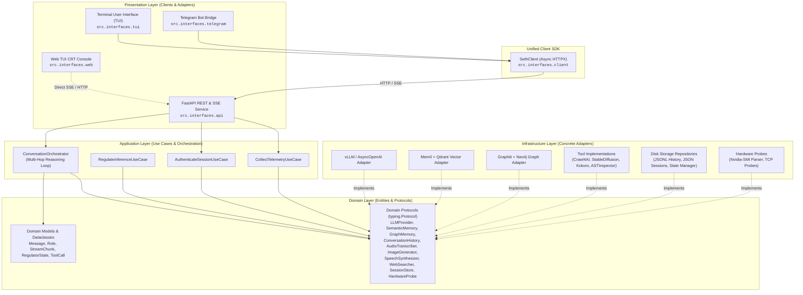
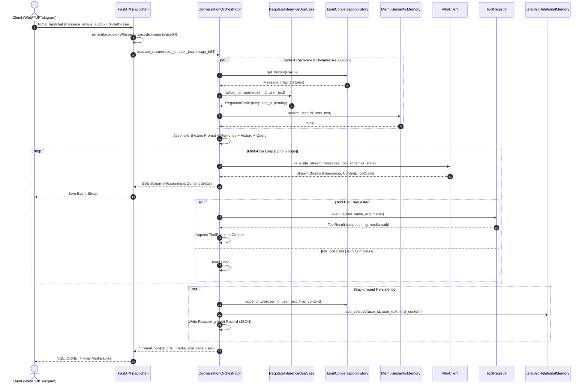
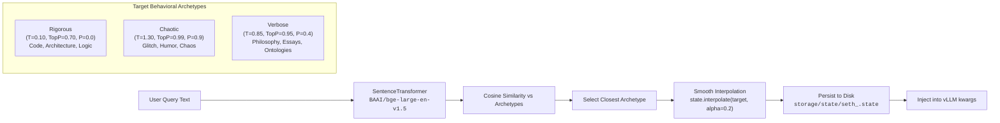
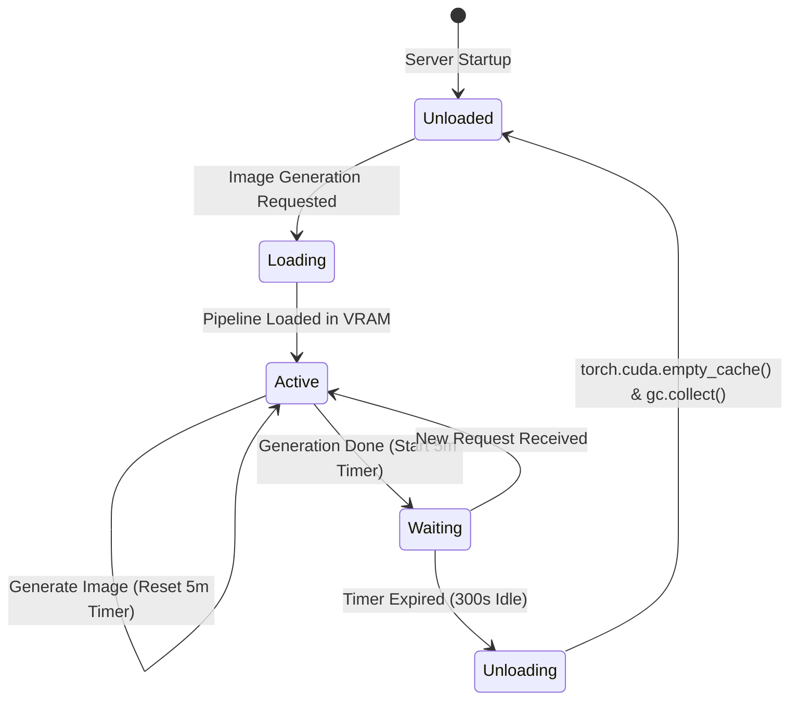

# Layered Architecture and Technical Design Specification
## SETH-IN-A-BOX // Multi-Interface Agentic AI Engine

> **Software Engineering Technical Specification**  
> **Project:** SETH-IN-A-BOX (AKA *Sentient Entity Thorn by Humans*)  
> **Version:** 2.0.0  
> **Architecture Style:** Decoupled Clean / Hexagonal Architecture (Ports & Adapters)  
> **Target Runtime:** Python 3.10+ (Recommended: Python 3.11+)  

---

## 1. Executive Summary & System Philosophy

**SETH-IN-A-BOX** is a modular, high-performance agentic AI oracle designed to run on local GPU hardware. Maintaining the core *"Fertile Glitch"* philosophy (creative chaos, noise of the void, and symmetrical phase transitions paired with surgical technical rigor) and a retro 80s/90s CRT BBS aesthetic, the system separates the heavy computational backend (**"The Brain"**) from presentation channels.

### Core Architectural Mandate
A single centralized backend service manages LLM inference, dynamic hyperparameter regulation, tri-tier memory, and heavy GPU generative models (Stable Diffusion, Kokoro TTS). Multiple presentation clients connect concurrently without duplicating model weights in GPU VRAM:

1. **FastAPI REST & SSE Service (`src/interfaces/api/`):** The primary backend node exposing HTTP endpoints, multipart multimodal uploads, and Server-Sent Events (SSE). Serves the Web TUI directly at `/`.
2. **Terminal User Interface (`src/interfaces/tui/`):** A console chat application built with `Rich`, featuring live reasoning thoughts (*Gemma 4 thinking*), content streaming, and hardware telemetry.
3. **Web TUI CRT Console (`src/interfaces/web/`):** A zero-build, cyberpunk Web TUI console with scanlines, matrix rain, microphone recording with waveform visualizer, and drag-and-drop vision support.
4. **Telegram Bot Adapter (`src/interfaces/telegram/`):** A lightweight bridge for remote/mobile access that streams requests to the API via HTTPX without loading local ML models.
5. **Unified Async Client SDK (`src/interfaces/client.py`):** An asynchronous Python SDK (`SethClient`) encapsulating authentication, chat streaming, and telemetry retrieval for all clients.

---

## 2. Comprehensive Capability Catalog

| Capability | Module / Component | Technical Description |
|---|---|---|
| **LLM Inference Engine** | `VllmClient` (`src/infrastructure/llm/`) | Asynchronous OpenAI-compatible client connecting to vLLM, SGLang, or Ollama. Streams token-by-token content and extracts thinking/reasoning deltas. |
| **Context Window Guard** | `ContextWindowGuard` (`src/infrastructure/llm/`) | Real-time token calculation using `AutoTokenizer.apply_chat_template` to dynamically adjust `max_tokens` and prevent context overflows. |
| **Multi-Hop Reasoning Loop** | `ConversationOrchestrator` (`src/application/`) | Iterative reasoning loop (up to 5 hops). Accumulates tool call deltas with `StreamAccumulator` and dispatches tools concurrently via `asyncio.gather`. |
| **Dynamic Inference Regulator** | `RegulateInferenceUseCase` (`src/application/use_cases/`) | Computes semantic cosine similarity of user queries against pre-computed archetype embeddings (`BAAI/bge-large-en-v1.5`), smoothly shifting `temperature`, `top_p`, and `presence_penalty` (*Rigorous, Chaotic, Verbose*). |
| **User State Manager** | `UserStateManager` (`src/application/use_cases/`) | Persists and loads isolated per-user hyperparameter states (`storage/state/seth_<user_id>.state`) with asynchronous locks. |
| **Short-Term Context Memory** | `JsonlConversationHistory` (`src/infrastructure/memory/`) | Sliding-window deque in RAM backed by atomic per-user JSONL logs (`conversations/history_<user_id>.jsonl`) with `asyncio.Lock`. |
| **Semantic Long-Term Memory** | `Mem0SemanticMemory` (`src/infrastructure/memory/`) | User facts, constraints, and preferences indexed in Qdrant Vector Store via Mem0 and BGE embeddings with TTL support. |
| **Temporal Knowledge Graph** | `GraphitiRelationalMemory` (`src/infrastructure/memory/`) | Background shadow ingestion of conversational episodes and relationship extraction using Graphiti + Neo4j. |
| **Web Search & Extraction** | `Crawl4AiSearcher` (`src/infrastructure/tools/`) | Live search via DuckDuckGo and concurrent markdown page extraction using headless browser (`Crawl4AI`). |
| **Local Image Synthesis** | `StableDiffusionGenerator` (`src/infrastructure/tools/`) | Text-to-image generation with Stable Diffusion (`DreamShaper 8`), DPM++ 2M Karras scheduler, and an automatic **VRAM offload timer (5 minutes idle)**. |
| **Speech Synthesis (TTS)** | `KokoroSynthesizer` (`src/infrastructure/tools/`) | Local Spanish speech synthesis via Kokoro TTS (`ef_dora` voice) exported as MP3. |
| **Speech-to-Text Transcription** | `_process_uploaded_audio` (`src/interfaces/api/routes/chat.py`) | Receives audio notes, auto-splits recordings >60s with `pydub`, and transcribes in parallel via `faster-whisper-server`. |
| **Multimodal Vision** | `_process_uploaded_image` (`src/interfaces/api/routes/chat.py`) | Stores uploaded images locally and encodes them into Base64 for injection into LLM multimodal chat templates. |
| **Source Code Self-Inspection** | `AstCodeInspector` (`src/infrastructure/tools/`) | Inspects local source code files via AST (Abstract Syntax Tree) to report class definitions, functions, and imports. |
| **Tool Discovery & Reflection** | `ToolRegistry` (`src/infrastructure/tools/`) | Automatically inspects Python type hints (`Annotated[T, "description"]`) and docstrings to generate OpenAPI/vLLM function schemas. |
| **Authentication & Access Control** | `AuthenticateSessionUseCase` (`src/application/use_cases/`) | Validates `REGISTRATION_TOKEN`, generates opaque UUID session identifiers, and manages `storage/allowed_api_users.json`. |
| **Hardware & Service Telemetry** | `CollectTelemetryUseCase` (`src/application/use_cases/`) | Non-invasive TCP socket probes to Whisper/Qdrant, Graphiti status checks, and GPU VRAM parsing via `nvidia-smi`. |
| **Reasoning Audit Logging** | `ReasoningAuditLogger` (`src/infrastructure/logging/`) | Persists detailed JSON records of each inference turn (hops, tool requests, latency, hyperparameters) with 30-day retention cleanup. |

---

## 3. Idiomatic Python Clean Architecture

The architecture enforces unidirectional dependencies flowing inward toward domain models and business use cases:



### 3.1 Pythonic Design Principles Applied
1. **Structural Subtyping via `typing.Protocol` (PEP 544):** Domain contracts are defined as pure structural protocols (`LLMProvider`, `SemanticMemory`, `GraphMemory`, etc.) without artificial `I` prefixes or mandatory inheritance.
2. **High-Performance Immutability:** Core domain entities (`Message`, `ToolCall`, `StreamChunk`, `MediaAttachment`) use `@dataclass(slots=True, frozen=True)` for minimal memory footprint and fast attribute access.
3. **Pydantic Settings v2 Configuration:** Centralized settings in `src/config/settings.py` read environment variables and validate required credentials at startup.
4. **Decoupled Tool Registration via Reflection:** Any Python instance method annotated with `@tool` and type hints is converted into an OpenAPI/vLLM function schema dynamically by `ToolRegistry`.

---

## 4. Directory & Module Structure

```text
.
├── README.md                   # Project documentation
├── pyproject.toml              # Packaging and dependency configuration
├── docker-compose.yml          # Infrastructure stack (vLLM, Whisper, Qdrant, Neo4j)
├── conversations/              # Per-user short-term history (JSONL)
├── models/
│   ├── dreamshaper_8.safetensors               # Local image weights
│   └── tool_chat_template_gemma4.jinja         # Custom chat template for vLLM
├── storage/
│   ├── images/                 # Generated images
│   ├── audio/                  # Generated speech & uploaded audio
│   ├── state/                  # Per-user regulator state files (seth_<user_id>.state)
│   ├── logs/                   # Run logs, reasoning hop audit records, and mem0 logs
│   ├── allowed_api_users.json  # Backend session allow-list
│   └── telegram_sessions.json  # Telegram ID to API Session ID mapping
└── src/
    ├── main.py                 # Unified CLI launcher (api, web, tui, telegram)
    ├── _env.example            # Template for environment variables
    ├── .env                    # Local runtime secrets (git-ignored)
    ├── prompt/
    │   └── seth.md             # Canonical system prompt and personality rules
    │
    ├── config/                 # Centralized Configuration Layer
    │   ├── __init__.py
    │   └── settings.py         # Pydantic Settings v2 with cached singleton
    │
    ├── domain/                 # Domain Layer (Zero External Framework Dependencies)
    │   ├── __init__.py
    │   ├── models.py           # Message, Role, StreamChunk, RegulatorState, SystemStatus
    │   ├── protocols.py        # Structural typing.Protocol definitions
    │   └── exceptions.py       # Domain exceptions (InferenceEngineError, ToolExecutionError)
    │
    ├── application/            # Application Layer (Use Cases & Orchestration)
    │   ├── __init__.py
    │   ├── orchestrator.py     # Multi-hop execution loop and stream assembly
    │   ├── dto.py              # Data Transfer Objects
    │   └── use_cases/
    │       ├── __init__.py
    │       ├── authenticate.py # Token validation and session creation
    │       ├── regulate.py     # Dynamic inference parameter regulation
    │       └── telemetry.py    # Microservice health checks and VRAM probes
    │
    ├── infrastructure/         # Infrastructure Layer (Adapters & Integrations)
    │   ├── __init__.py
    │   ├── llm/
    │   │   ├── vllm_client.py  # OpenAI-compatible vLLM adapter
    │   │   ├── context_guard.py# AutoTokenizer token estimation guardrail
    │   │   └── accumulator.py  # Streaming delta accumulator for tool calls
    │   ├── memory/
    │   │   ├── jsonl_history.py# Short-term context with JSONL file locking
    │   │   ├── qdrant_mem0.py  # Mem0 semantic long-term memory in Qdrant
    │   │   └── neo4j_graphiti.py# Graphiti temporal knowledge graph in Neo4j
    │   ├── tools/
    │   │   ├── registry.py     # Tool decorator and schema reflection engine
    │   │   ├── image_diffusion.py # Stable Diffusion with idle auto-offload
    │   │   ├── speech_kokoro.py# Kokoro TTS Spanish audio synthesis
    │   │   ├── web_search.py   # DuckDuckGo + Crawl4AI web extraction
    │   │   └── code_inspector.py # AST Python code self-inspector
    │   ├── security/
    │   │   └── json_sessions.py# On-disk session whitelist store
    │   ├── telemetry/
    │   │   ├── nvidia_smi.py   # NVML VRAM hardware parser
    │   │   └── tcp_probe.py    # Non-invasive socket reachability probes
    │   └── logging/
    │       ├── setup.py        # ColoredLogs and logger hierarchy configuration
    │       └── audit.py        # Reasoning audit logger with 30-day retention
    │
    └── interfaces/             # Presentation Layer (API & Clients)
        ├── __init__.py
        ├── client.py           # Asynchronous Python SDK (SethClient)
        ├── api/                # FastAPI Backend Service
        │   ├── app.py          # FastAPI factory, lifespan, and static mounting
        │   ├── dependencies.py # Dependency injection providers (Depends)
        │   ├── routes/         # Route handlers (auth, chat, status)
        │   └── middleware/     # Private Network Access & Log filters
        ├── web/                # Standalone Web TUI Launcher & Static Assets
        │   ├── app.py          # HTTP static server with API probe
        │   └── static/index.html # Cyberpunk CRT Console Single-Page App
        ├── tui/                # Interactive Terminal Console (Rich)
        │   └── app.py          # Live streaming TUI client
        └── telegram/           # Telegram Bot Bridge
            ├── bot.py          # Telegram polling runner
            ├── handlers.py     # Media and message handlers
            └── session_store.py# Telegram ID to API Session ID mapper
```

---

## 5. Core Data Flows & Sequences

### 5.1 End-to-End Multimodal Chat & Multi-Hop Execution



### 5.2 Dynamic Hyperparameter Regulation Flow



### 5.3 VRAM Auto-Offload Lifecycle for Stable Diffusion



---

## 6. HTTP API Contracts & SSE Protocol

### 6.1 `POST /api/register`
* **Purpose:** Exchange secret registration token for an authorized session ID.
* **Request Body (JSON):**
  ```json
  { "token": "YOUR_SECRET_REGISTRATION_TOKEN" }
  ```
* **Response (JSON, HTTP 200):**
  ```json
  {
    "status": "ok",
    "user_id": "01b35231bd5f47c6a865a2e204c12996",
    "message": "✅ Welcome! I am SETH. Save this user_id and pass it as the 'X-Seth-User' header on every request."
  }
  ```

### 6.2 `POST /api/chat`
* **Purpose:** Multimodal chat endpoint streaming responses via Server-Sent Events.
* **Headers:** `X-Seth-User: <session_uuid>`
* **Content-Type:** `multipart/form-data`
* **Form Fields:**
  * `message` *(string, optional)*: Text prompt.
  * `image` *(binary file, optional)*: PNG/JPEG/WEBP upload.
  * `audio` *(binary file, optional)*: OGG/WAV/MP3 voice recording.
* **SSE Event Types:**
  ```text
  data: {"choices": [{"delta": {"reasoning": "Analyzing requirements..."}}]}
  data: {"choices": [{"delta": {"content": "Here is the architectural overview..."}}]}
  data: {"seth_event": {"type": "tool_start", "name": "web_search"}}
  data: {"seth_event": {"type": "tool_end", "name": "web_search", "ok": true}}
  data: {"choices": [{"finish_reason": "stop"}], "seth_meta": {"media": [{"type": "image", "url": "/storage/images/gen_123.png"}], "tool_calls_used": ["create_image"]}}
  data: [DONE]
  ```

### 6.3 `GET /api/status`
* **Purpose:** Consolidated hardware and microservice health telemetry.
* **Response (JSON, HTTP 200):**
  ```json
  {
    "vllm": "online",
    "whisper": "online",
    "qdrant": "online",
    "neo4j_graphiti": "online",
    "vram": [
      {
        "index": 0,
        "name": "NVIDIA GeForce RTX 4090",
        "used_gb": 18.42,
        "total_gb": 23.99
      }
    ]
  }
  ```

---

## 7. Storage, State & Persistence Layout

| Path | Format | Description | Concurrency Protection |
|---|---|---|---|
| `conversations/history_<user_id>.jsonl` | JSONL | Rolling window of user/assistant conversational turns. | `asyncio.Lock` per user session |
| `storage/state/seth_<user_id>.state` | JSON | Dynamic inference hyperparameters (`temperature`, `top_p`, `presence_penalty`). | `asyncio.Lock` per user session |
| `storage/logs/reasoning/audit_<timestamp>_<id>.json` | JSON | Full reasoning audit log (hops, tool execution times, prompts, responses). | Atomic file writes |
| `storage/allowed_api_users.json` | JSON | Whitelist of registered UUID session identifiers. | `threading.Lock` |
| `storage/telegram_sessions.json` | JSON | Mapping of Telegram chat IDs to API session UUIDs. | `threading.Lock` |
| `storage/images/gen_*.png` | PNG | Output files generated by Stable Diffusion. | Unique timestamps + random ID |
| `storage/audio/speech_*.mp3` | MP3 | Output audio files synthesized by Kokoro TTS. | Unique timestamps + random ID |

---

## 8. Operational Quick Start & Execution

```bash
# 1. Install all dependencies (API, Telegram, TUI)
pip install -e ".[all]"

# 2. Configure environment
cp src/_env.example src/.env
# Edit src/.env with registration tokens and service endpoints

# 3. Start Infrastructure Stack (Docker Compose)
docker compose up -d

# 4. Launch Backend API (Primary Node)
python -m src.main api

# 5. Launch Presentation Clients (in separate terminals)
python -m src.main tui                       # Terminal User Interface
python -m src.main web                       # Standalone Web CRT Console
python -m src.main telegram                  # Telegram Bot Bridge
```
